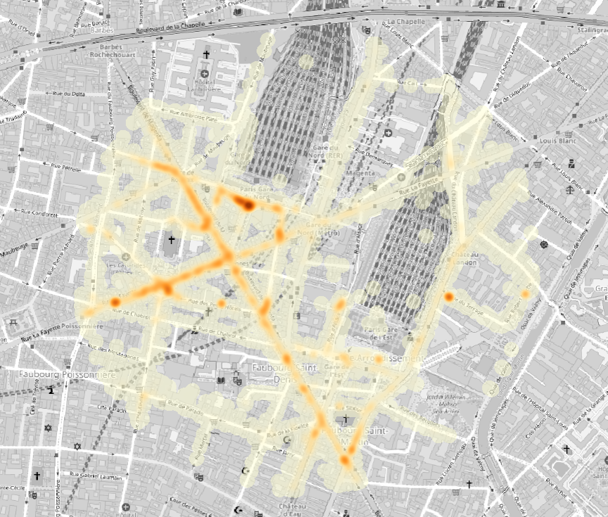

**Webinaire Carte Blanche #14. mardi 14 mai 2024 (12h30-13h30)**  
_Cartographier et analyser les pratiques des V.T.C. dans les quartiers de gare_  
par [Marion Albertelli](https://www.linkedin.com/in/marion-albertelli-06659749/?originalSubdomain=fr), L.V.M.T. & UMR 8504 Géographie-cités.

**Résumé** : Dans le cadre d’un travail de thèse réalisé en partenariat avec SNCF Gares & Connexions sur l’insertion urbaine des gares françaises,
Marion Albertelli a questionné les échelles territoriales de trente gares françaises en termes d’accessibilité et de services de mobilité. Les gares
sont considérées par les acteurs régionaux et métropolitains comme des pôles majeurs pour l’organisation et la gestion des mobilités alternatives aux
véhicules motorisés individuels. L’un des résultats de cette recherche est que les nouvelles formes de mobilité partagées restent en marge de la gestion
des pôles d’échanges des gares ferroviaires. Grâce à l’obtention d’une base de données permettant le suivi de V.T.C. réalisant des trajets à destination
ou depuis cinq gares de la région parisienne sur une année (07.2017-07.2018), des cartes de chaleurs sur les parcours de V.T.C. dans les quartiers de gare
ont pu être réalisées. Elles ont permis de visualiser leurs pratiques dans des quartiers très contraints par la densité de flux et de services de mobilité. 
  
**Ressources**  
- [Support de la présentation](https://sharedocs.huma-num.fr/wl/?id=DH5OdW047FrPIpGVNREe1p4mc1kgQdVZ)

- 📺 [Video du webinaire](https://sharedocs.huma-num.fr/wl/?id=tvVe622MLDnYyPMWotNc13bvuxou7Ofn)

Retour à l'accueil des [Webinaires Cartes Blanches](https://github.com/magisAR9/webinaires)
