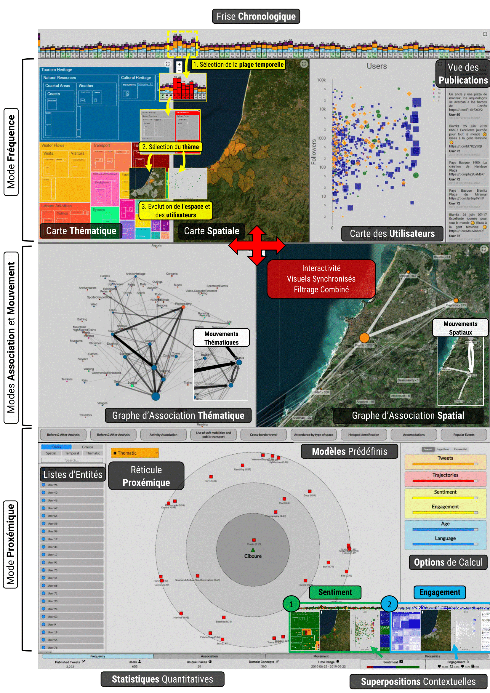

**Webinaire Carte Blanche #10. jeudi 18 janvier 2024 (12h30-13h30)**  
_TextBI : Une plateforme interactive pour la visualisation de données multidimensionnelles issues des réseaux sociaux_  
par **Maxime MASSON[^1]**, Christian Sallaberry[^1], Marie-Noelle Bessagnet[^1], Philippe Roose[^1], Annig Le Parc Lacayrelle[^1], Rodrigo Agerri[^2]

**Résumé** : 
TextBI est un tableau de bord interactif destiné à visualiser des indicateurs multidimensionnels sur de grandes quantités de données multilingues issues des réseaux sociaux.
Il cible quatre dimensions principales d’analyse : spatiale, temporelle, thématique et personnelle, tout en intégrant des données contextuelles comme le sentiment et l'engagement.
Offrant plusieurs modes de visualisation, cet outil s'insère dans un cadre plus large visant à guider les diverses étapes de traitement de données des réseaux sociaux.
Bien qu'il soit riche en fonctionnalités, il est conçu pour être intuitif, même pour des utilisateurs non informaticiens.
Son application a été testée dans le domaine du tourisme en utilisant des données de Twitter (aujourd’hui X) mais il a été conçu pour être générique et adaptable à de multiples domaines. 

**Accès Zoom**  
[Lien](https://pantheonsorbonne.zoom.us/j/91396916407)  
-ID de réunion : 913 9691 6407 | Code secret : AR9m@gis 

**Ressources**  

[^1]: [LIUPPA, E2S, Université de Pau et des Pays de l'Adour (UPPA), Pau, France](https://liuppa.univ-pau.fr/fr/organisation/equipes-de-recherche/equipe-t2i.html)
[^2]: [Centre HiTZ - Ixa, Université du Pays Basque UPV/EHU, Donostia-San Sebastian, Espagne](https://ixa.ehu.eus/)

Retour à l'accueil des [Webinaires Cartes Blanches](https://github.com/magisAR9/webinaires)
