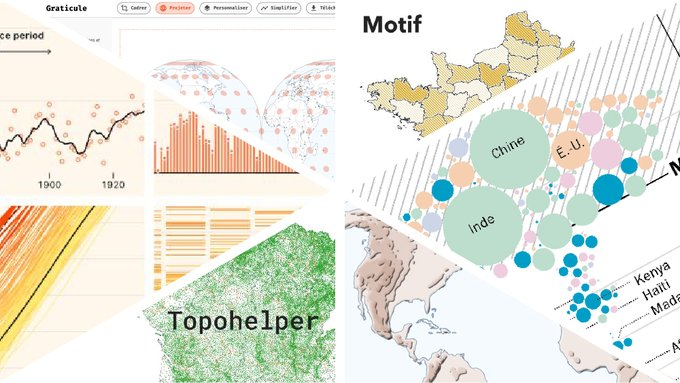

**Webinaire Carte Blanche #11. Mardi 6 février 2024 (12h30-13h30)**  
_Ce que le code a apporté dans ma pratique de la dataviz_ par [Thomas Ansart](https://thomasansart.info/) (Atelier de cartographie de Sciences Po)  

**Résumé** : Au regard d’une décennie d’expérience en dataviz, j’aimerais revenir sur les raisons qui m’ont poussé à l’acquisition progressive de compétences en code ainsi que sur plusieurs projets/outils représentatifs de l’évolution de ma pratique.*

**Suppprt de présentation**

https://sharedocs.huma-num.fr/wl/?id=RGD0WN7lx9Z0jYD8SSMKSxdWuYmRFx8T

**Vidéo**

https://sharedocs.huma-num.fr/wl/?id=7w35yvuTOmwOBULuuBEJ9BcCWJwTMPrS

Retour à l'accueil des [Webinaires Cartes Blanches](https://github.com/magisAR9/webinaires)
