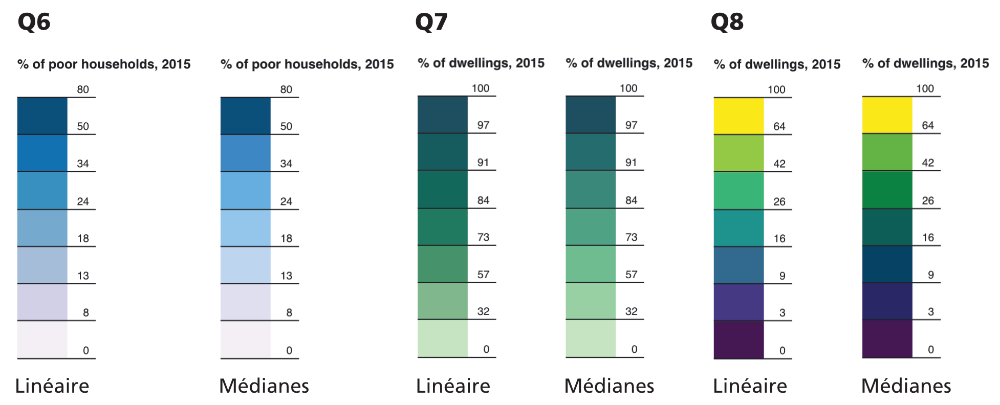

**Webinaire Carte Blanche #16. Mardi 25 juin 2024 (12h30-13h30)**  
_Des cartes et des couleurs : enquête sur les gradients_ par [Laurent Jegou](https://ljegou.github.io/), MCF, UMR LISST, Université Toulouse-Jean Jaurès.  

**Résumé** : Mes recherches s'intéressent depuis longtemps aux usages de la couleur en cartographie thématique. J'ai d'abord proposé de jouer sur les gradients pour exprimer plus de sens, en se basant notamment sur un outil d'analyse de la fréquence et des relations colorées dans les images, ce qui permet aussi de sortir des gradients prêts à l'emploi qui deviennent des poncifs et standardisent un peu trop les cartes thématiques. Dernièrement, je propose d'évaluer la progression lumineuse des gradients standards et de l'adapter en luminosité pour suivre la progression des valeurs représentées, ce qui permet de mieux exprimer les valeurs de la variable. Une enquête en ligne tend à montrer que c'est bien le cas : les données sont plus lisibles lorsque le gradient leur est adapté.
 

**Accès au webinaire**
- [Lien](https://bbb.unistra.fr/b/bro-r7m-ugj-wpp)  
- Code d'accès : 002585  

Retour à l'accueil des [Webinaires Cartes Blanches](https://github.com/magisAR9/webinaires)
