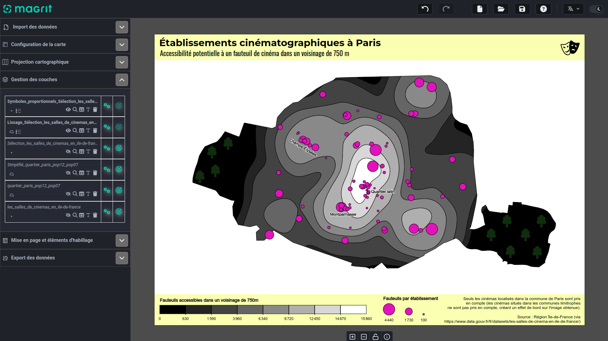

## Webinaire Carte Blanche #17

**La nouvelle version de Magrit**

**Mardi 24 septembre 2024 (12h30-13h30)** 

Par [Matthieu Viry](https://mthh.github.io/portfolio/), ingénieur de recherche en informatique CNRS à l'UAR [RIATE](https://riate.cnrs.fr/).

**Résumé** : Ce webinaire présente l'application de cartographie thématique Magrit et en particulier les nouveautés offertes par la version 2 de l'application, sortie en juillet 2024 : nouvelles fonctionnalités relatives à la préparation des données, nouvelles possibilités de représentations, personnalisation accrue des cartes réalisées, etc.
Ce webinaire s'articulera en 3 principaux temps : un retour sur les choix effectués et ayant permis d'aboutir à une nouvelle version de l'application, un cas d'étude réel (réalisation d'une carte à partir de données disponibles en Open Data) puis une présentation des nombreuses perspectives d'évolution (ajouts de nouvelles fonctionnalités d'analyse statistiques, etc.).

**Accès Zoom**  

- [Lien](https://cnrs.zoom.us/j/96097221707?pwd=rEf3u8IrvI9YS17iRWNjwcuE96j1GF.1)

-ID de réunion : 960 9722 1707 | Code secret : pvXM12

**Ressources** : 

- [MAGRIT](https://magrit.cnrs.fr/)

- [Documentation](https://magrit.cnrs.fr/documentation.html) 

- [Dépot Github](https://github.com/riatelab/magrit) 

📺 [Video du webinaire](à venir)  

Retour à l'accueil des [Webinaires Cartes Blanches](https://github.com/magisAR9/webinaires)
