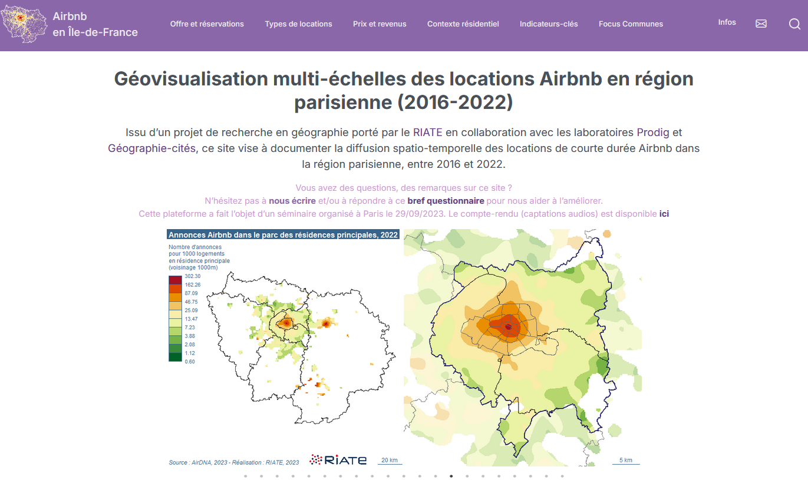

**Webinaire Carte Blanche #20. mardi 12 novembre 2024 (12h30-13h30)** 

_Mise en place d'une plateforme de géovisualisation des locations Airbnb en Ile-de-France : enjeux et perspectives_ 

par [Ronan Ysebaert](https://rysebaert.gitpages.huma-num.fr/cv/) [1], Louis Laurian [2], Marianne Guerois [3] et Malika Madelin [4] 

**Résumé** : Cette communication présente les principaux résultats issus de la construction d’une plateforme de géovisualisation des hébergements Airbnb en région parisienne. Ce site web a été développé pour rendre accessible une collection de cartes et graphiques inédits à l’échelle régionale. Il vise à documenter la diffusion de l’offre de ces locations de courte durée, en particulier au-delà des quartiers centraux, ce phénomène ayant été rarement étudié dans les banlieues proches ou lointaines des grandes métropoles touristiques alors qu’il tend à s’y déployer. Plus largement, ce site-prototype a rassemblé un collectif d’acteurs scientifiques et institutionnels, pour qui la plateforme représente un levier d’action pour la mutualisation de données, d’indicateurs et de visualisations utiles à la prise de décision, dans un contexte de crise du logement aiguë (cf colloque ci-dessous). Se pose ainsi en corollaire la question de la pérénisation de la démarche et son extension à d’éventuels autres terrains d’étude. 

[1] Université Paris Cité, UAR RIATE - [2] CNRS, UAR RIATE - [3] Université Paris Cité, UMR Géographie-Cités - [4] Université Paris Cité, UMR PRODIG

- 📺 [Video du webinaire](https://podv2.unistra.fr/video/57098-ar920mp4/)  

**Ressources** : 
- [Riate airbnb](https://riate-airbnb.gitpages.huma-num.fr/website/) : la plateforme de visualisation 
- [Locations meublées touristiques dans le Grand Paris](https://riate-airbnb.gitpages.huma-num.fr/colloque/) : colloque organisé conjointement par le [RIATE](https://riate.cnrs.fr/) et l’[APUR](https://www.apur.org/fr) (septembre 2023)
- [github/rysebaert](https://github.com/rysebaert)
- [github/riatelab](https://github.com/riatelab)

Retour à l'accueil des [Webinaires Cartes Blanches](https://github.com/magisAR9/webinaires)
