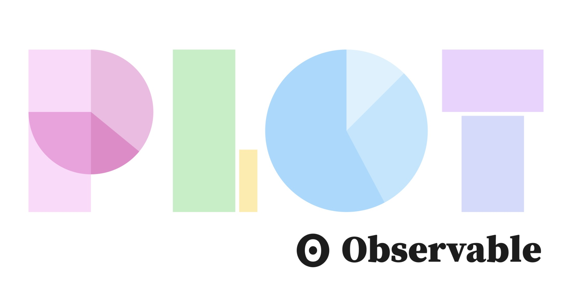

**Webinaire Carte Blanche #2. Mercredi 7 décembre 2023 (12h30-13h30)**  
_Faire des cartes thémétiques avec Observable Plot_ par [Philippe RIVIERE](https://observablehq.com/@fil) (Visions Carto, Observable)  

**Résumé** : Observable Plot est une librairie JavaScript gratuite et open-source qui permet de visualiser rapidement des données tabulaires. Elle dispose d'une API concise et mémorable pour favoriser la fluidité. Plot ne propose pas des types de graphiques. Au lieu de cela, met à disposition des  "marques" (points, lignes, barres...) qu'il est possible de transformer et combiner. Et aujourd'hui Plot met introduit les marques géographiques 🌏 pour permettre la réalisation de cartes statistiques. C'est cette nouvelle fonctionnalité que que Philippe Rivière (qui maintient la librairie avec Mike Bostock) propose de présenter lors de ce wébinaire.

**Accès Zoom**  

[https://cnrs.zoom.us/j/94166160780?pwd=bFlPc0RGV2RIVkNlOXRHS3hKeTNJUT09](https://cnrs.zoom.us/j/94166160780?pwd=bFlPc0RGV2RIVkNlOXRHS3hKeTNJUT09)

Meeting ID: 941 6616 0780
Passcode: 0FV1hC

**Ressources**  
- [Observable Plot sur Github](https://github.com/observablehq/plot) 
- [Observable Notebooks](https://observablehq.com/collection/@observablehq/plot) 
- [Cheatsheets](https://observablehq.com/collection/@observablehq/plot-cheatsheets) 

📺 [Vidéo du Webinaire : à venir]  

Retour à l'accueil des [Webinaires Cartes Blanches](https://github.com/magisAR9/webinaires)
