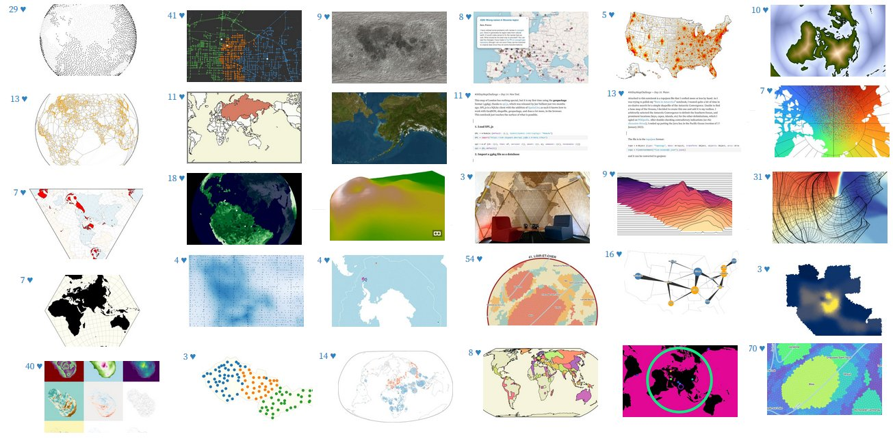

**Webinaire Carte Blanche #2. Mercredi 7 décembre 2023 (12h30-13h30)**  
_Expérimentations cartographiques dans mon navigateur web_ par [Philippe RIVIERE](https://observablehq.com/@fil) (Visions Carto, Observable)  

**Résumé** : En novembre 2021 j'ai produit une trentaine d'expérimentations cartographiques, une par jour, qui toutes fonctionnent 
dans le navigateur web. Qu'il s'agisse de charger des données géospatiales dans un format moderne, d'implémenter une méthode d'interpolation
spatiale, ou d'inventer un nouveau type de carte isodémographique, il n'est plus indispensable d'installer des outils complexes
sur son ordinateur. Une simple page web, un peu de code javascript, permet de démarrer—et de publier—instantanément.

**Accès Zoom**  

[https://cnrs.zoom.us/j/94166160780?pwd=bFlPc0RGV2RIVkNlOXRHS3hKeTNJUT09](https://cnrs.zoom.us/j/94166160780?pwd=bFlPc0RGV2RIVkNlOXRHS3hKeTNJUT09)

Meeting ID: 941 6616 0780
Passcode: 0FV1hC

**Ressources**  

[Observable Notebook](https://observablehq.com/@visionscarto/30-days-and-as-many-maps) 
📺 [Vidéo du Webinaire : à venir]  

Retour à l'accueil des [Webinaires Cartes Blanches](https://github.com/magisAR9/webinaires)
