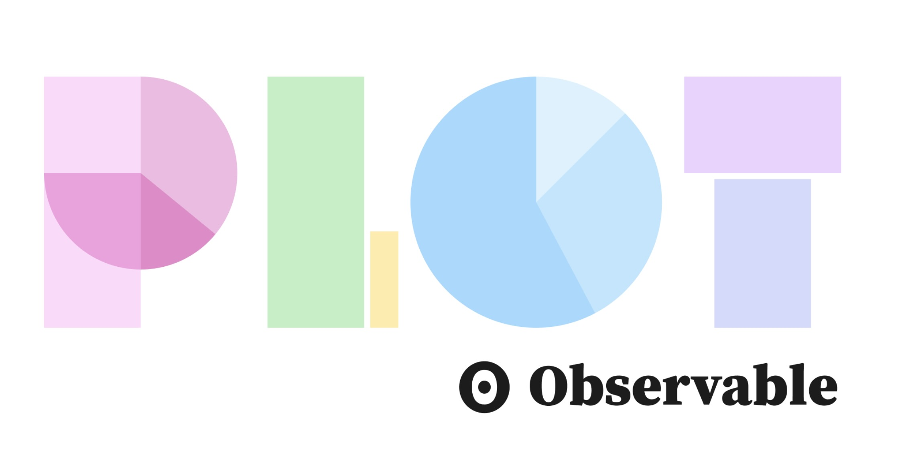

**Webinaire Carte Blanche #2. Mercredi 7 décembre 2023 (12h30-13h30)**
_Faire des cartes statistiques avec Observable Plot_ par [Philippe RIVIERE](https://observablehq.com/@fil) (Visions Carto, Observable)  

**Résumé** : Observable Plot est une librairie JavaScript gratuite et open-source qui permet de visualiser rapidement des données tabulaires. Elle dispose d'une API concise et mémorisable pour favoriser la fluidité. Plot ne propose pas des types de graphiques clé en main. Au lieu de cela, l'api met à disposition des "marques" (points, lignes, barres...) qu'il est possible de transformer et combiner. Et aujourd'hui Plot introduit les marques géographiques 🌏 pour permettre la réalisation de cartes statistiques. C'est cette nouvelle fonctionnalité que que Philippe Rivière présente lors de ce wébinaire.

**Ressources**  
- [Observable Plot sur Github](https://github.com/observablehq/plot) 
- [Observable Notebooks](https://observablehq.com/collection/@observablehq/plot) 
- [Cheatsheets](https://observablehq.com/collection/@observablehq/plot-cheatsheets) 

📺 [Vidéo du Webinaire](https://sharedocs.huma-num.fr/wl/?id=cw6jUGyiTn1C1Z50eP6G1D7mgODWSPbY)  

Retour à l'accueil des [Webinaires Cartes Blanches](https://github.com/magisAR9/webinaires)
