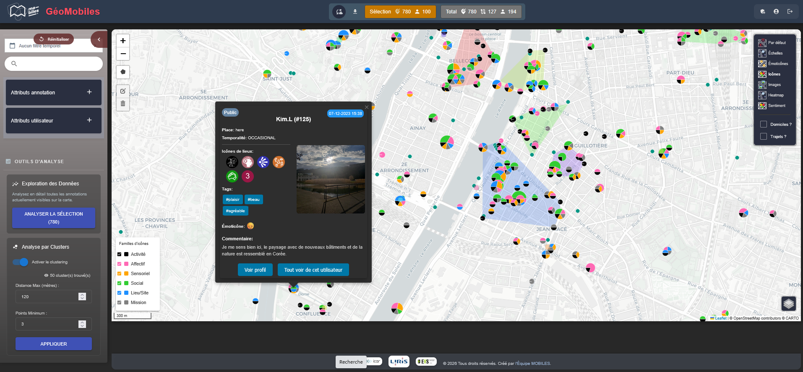

## Webinaire Carte Blanche #27

**Jeudi 25 juin 2026 (12h30-13h30)** 

Ce que les expériences vécues révèlent des lieux : le potentiel analytique des géovisualisations_

Claire Cunty, Hélène Mathian, Camille Scheffler, [EVS - Laboratoire environnement ville société](https://umr5600.cnrs.fr/fr/accueil/).

**Résumé** :
De nombreuses applications mobiles proposent de laisser des traces géolocalisées de nos différentes expériences vécues ou pratiques spatiales. La partie cartographique de ces applications permet le recueil de ces informations et le fond de carte devient le support cet inventaire que chacun·e peut venir explorer par le biais d’outils de recherche. Mais qu’est-ce que ces collections d’expériences vécues localisées peuvent nous apprendre des lieux, et réciproquement ? À partir d’un jeu d’annotations retraçant le vécu d’étudiant·es étrangers arrivant à Lyon, nous proposons d’interroger la capacité de nos outils de géovisualisation à rendre compte de ces objets sensibles de manière analytique, et des questions que cela soulève  dès lors que l’on souhaite revenir au territoire.

Légende de l'illustration :  _GéoMobiles : un outil d’exploration, d’analyse et de géovisualisation d’expériences vécues par des étudiant·es internationaux·ales en région lyonnaise_, ANR MOBILES (ANR-20-CE38-0009)

📺 [La vidéo du webinaire](https://pod.unistra.fr/video/63027-geomobiles-ce-que-les-experiences-vecues-revelent-des-lieux/)

👉 [La présentation au format .pdf](https://github.com/magisAR9/webinaires/blob/main/img/MOBILES_CarteBlanche_AR9magis_250626.pdf)

👉 [Le chat du webinaire](https://github.com/magisAR9/webinaires/blob/main/img/AR%2327-chat-20260625.txt)

Retour à l'accueil des [Webinaires Cartes Blanches](https://github.com/magisAR9/webinaires)
