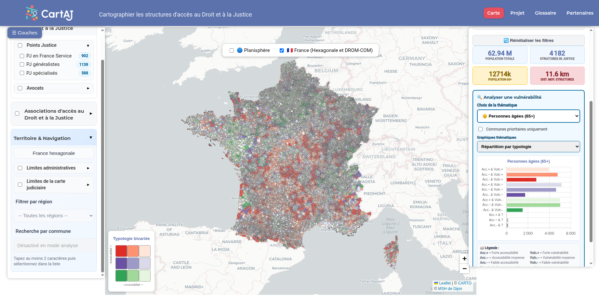

**Webinaire Carte Blanche #28. 8 juillet 2026 (12h30-13h30)**

_Cartographier l'incertitude : l'exemple de l'accessibilité aux services juridiques ([CartAJ](https://msh-dijon.ube.fr/fiche-de-presentation-programme-cartaj-cartographier-les-structures-dacces-au-droit-et-a-la-justice/)_)

par **Lucile Pillot**, Ingénieure d'études cartographe géomaticienne, responsable du [pôle GéoBFC](https://mshe.univ-fcomte.fr/geobfc),
Université Bourgogne Europe (UBE), Maison des sciences de l'Homme de Dijon - UAR3516 UBE-CNRS

**Résumé :** 

CartAJ est une application de webmapping qui cartographie l'accessibilité aux services juridiques pour les communes françaises. Développée par [GéoBFC](https://mshe.univ-fcomte.fr/geobfc) 
à la MSH Dijon en partenariat avec le Ministère de la Justice, elle croise des données carroyées INSEE à 200 m avec la localisation des structures juridiques pour produire une typologie bivariée des communes croisant accessibilité et vulnérabilité de populations cibles choisies. L'outil s'adresse aux décideurs publics pour la priorisation des implantations, et aux chercheurs pour l'analyse des inégalités territoriales.
Mais quelle confiance accorder aux résultats affichés ?

Une carte choroplèthe présente des valeurs agrégées sans toujours rendre compte de leur robustesse statistique. Or les données cartographiées comportent plusieurs sources d'incertitude,
qualifiables et quantifiables mais pas toujours rendues visibles sur une carte. Dans le cas de CartAJ, on en identifie quatre qui seront présentées lors du webinaire. Au regard de ces limites, 
CartAJ propose d'explorer l'incertitude dans la cartographie, en construisant un score de confiance composite qui synthétise ces quatre dimensions

 
[CartAJ](https://msh-dijon.ube.fr/fiche-de-presentation-programme-cartaj-cartographier-les-structures-dacces-au-droit-et-a-la-justice/) – _CARTographier les structures d’Accès au droit et à la Justice_

**Accès au webinaire**

[Rejoindre la réunion sur bbb - bbb.unistra.fr/rooms/bro-r7m-ugj-wpp/join](https://bbb.unistra.fr/rooms/bro-r7m-ugj-wpp/join). Code d'accès : 002585

Retour à l'accueil des [Webinaires Cartes Blanches](https://github.com/magisAR9/webinaires)
