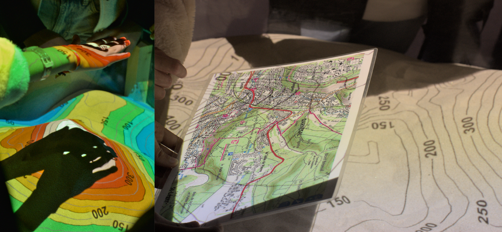

## Webinaire Carte Blanche #29 - 
**Jeudi 17 septembre 2026 (12h30-13h30)** 

_AR-GeoSim : un dispositif de médiation scientifique pour sensibiliser aux transformations environnementales_

par [Armelle COUILLET](https://umr-idees.fr/annuaire/armelle-couillet?tab=1), Ingénieure de recherches CNRS à 
l'[UMR IDEES 6266](https://umr-idees.fr/),   avec la collaboration de Julien NIAT TOUNDJI-TCHATCHOUA.

**Résumé** : Face aux changements globaux en cours, la médiation scientifique sur les questions Société/Environnement répond
à d’importants besoins en matière de politiques publiques. Parmi les dispositifs existants, le bac à sable à réalité augmentée ([AR-Sandbox](https://ar-sandbox.com/fr/)),
offre par ses qualités haptiques, des opportunités permettant de sensibiliser des publics divers à des enjeux tel l’écoulement de l’eau en
lien avec l’évolution des régimes des précipitations et de l’occupation du sol.
Le programme pluridisciplinaire [AR-GeoSim](https://umr-idees.fr/recherche/projets/le-projet-ar-geosim) (2026-2027), financé par la région Normandie et piloté par 
l’UMR IDEES (UMR 6266) explore et développe des solutions favorisant l’interactivité du dispositif en s’appuyant sur une enquête de
perception menée auprès de 250 élèves, du niveau élémentaire à la classe de Première.

**Ressources** : 

- [AR-Sandbox](https://ar-sandbox.com/fr/)
- [slides - à venir]

**Se connecter** :   
Lien : [accès Zoom](https://univ-eiffel.zoom.us/j/87364394927)   
Mdp : ar9magis

📺 [Vidéo du Webinaire - à venir]()

Retour à l'accueil des [Webinaires Cartes Blanches](https://github.com/magisAR9/webinaires)
