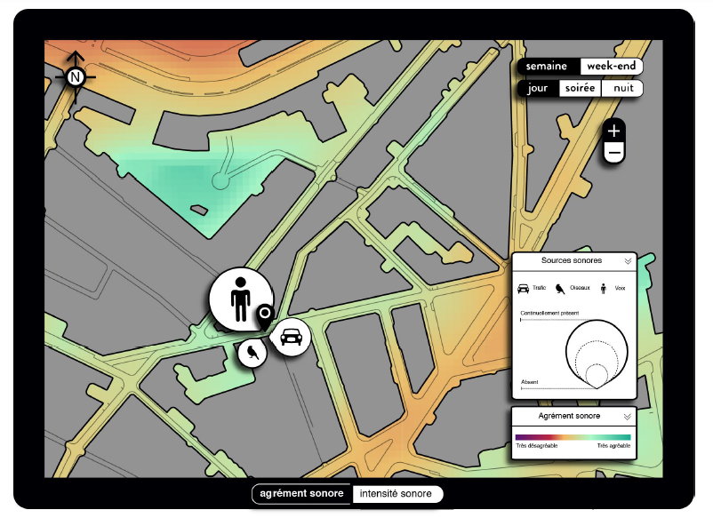

**Webinaire Carte Blanche #3. Jeudi 2 février 2023 (12h30-13h30)**  
_Cartographie du paysage sonore urbain_  
par Pierre AUMOND, CR Univ. Gustave Eiffel, CEREMA, UMRAE,   
 [@SoundCartograp1](https://twitter.com/SoundCartograp1), [Soundcartography](https://soundcartography.wordpress.com/)

_Carte issue de la sélection de l’agrément sonore un jour de semaine au lieu du positionnement du curseur,
avec représentation de la présence des trois types de sources sonores._  
Source : Projet Ademe Cart_ASUR

**Résumé** : La cartographie des environnements sonores est périlleuse car il y a une imbrication de messages sonores diffus
provenant d'une grande variété de sources. La complexité augmente encore lorsqu'il s'agit d'intégrer une partie sensible liée
à leur perception par les individus. Des travaux relatifs à ce sujet seront présentés et commentés.

**Ressources**  
📺 [Video du webinaire](https://bit.ly/3KoOBrs)  

Retour à l'accueil des [Webinaires Cartes Blanches](https://github.com/magisAR9/webinaires)
