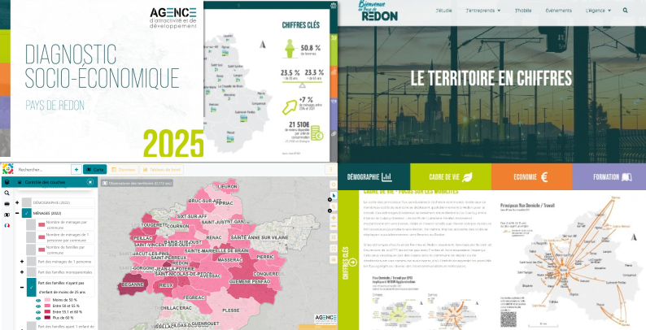

Webinaire Carte Blanche #30. jeudi 15 octobre 2026 (12h30-13h30)

_Échos de la recherche dans la production de cartes et la géovisualisation de données au niveau d’une agglomération rurale_

par Suzanne Catteau, docteure en géographie, géomaticienne, [Agence d'attractivité et de développement](https://bienvenuearedon.fr/publications/), Redon (Bretagne)

**Résumé** : Les webinaires de l'AR9 rythment l'année en permettant de découvrir de nouveaux outils ou en soulevant des questions autour de la sémiologie graphique dans l'actualité de la recherche. Cette intervention propose d'analyser la résonance que peuvent avoir ces webinaires dans la mise à jour d'un WebSIG et la conception d'un atlas décliné sur deux supports, une version imprimée et une version en ligne, au niveau d’une agglomérat
Selon les supports, les logiciels et la structure des données mobilisées, les questions autour de la sémiologie graphique se redéploient sans cesse. Et au-delà des aspects techniques, les discussions avec les commanditaires et/ou utilisateurs des cartes soulignent l’importance de ces questionnements et les enjeux politiques sous-jacents.

Informations de connexion

- Lien : [https://bbb.unistra.fr/rooms/bro-r7m-ugj-wpp/join](https://bbb.unistra.fr/rooms/bro-r7m-ugj-wpp/join) 
- Mot de passe : 002585

Retour à l'accueil des [Webinaires Cartes Blanches](https://github.com/magisAR9/webinaires)
