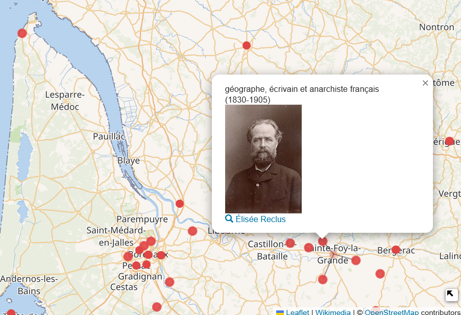

## Webinaire Carte Blanche #31 - 
**Mardi 3 novembre 2026 (12h30-13h30)** 

_(Géo)visualiser les communs : explorations autour des données de Wikidata et OpenStreetMap_

par [Delphine MONTAGNE](https://umr-idees.fr/annuaire/armelle-couillet?tab=1), Ingénieure d'études en Sciences 
de l'information géographique à l'université de Pau, UMR TREE, Wikimédienne en résidence à l'[URFIST](https://urfist.chartes.psl.eu/) 
de Paris.

_Carte des personnalités que l'on peut écouter sur Radio France_.   

 

Pour accéder à la **carte interactive**, exécutez cette requête  SPARQL sur _Wikidata Query Service_ : [Ecouter le monde via Radio France](https://w.wiki/7imT).
  

**Résumé** : [_Wikidata_](https://www.wikidata.org/wiki/Wikidata:Main_Page) est une base de données issue du web sémantique qui contient
des données géographiques et [_OpenStreetMap_](https://www.openstreetmap.org/) sont des communs numériques, gérés, maintenus et enrichis
par une communauté dévouée de bénévoles. Cette intervention vous proposera une exploration des (géo)visualisations possibles avec ces 
deux bases et les expérimentations réalisées (blog hypotheses.org, tableaux de bord...).

**Ressources** : 

- Suivre le projet [Wikifier la science](https://fr.wikipedia.org/wiki/Projet:Wikifier_la_science/Paris)  
→ Rejoindre la [liste mail _Wikimédia_ et ESR](https://groupes.renater.fr/sympa/subscribe/wikimedia-esr?previous_action=info)

- [slides - à venir]

**Se connecter** :   
Lien Web : 

📺 [Vidéo du Webinaire - à venir]()

Retour à l'accueil des [Webinaires Cartes Blanches](https://github.com/magisAR9/webinaires)
