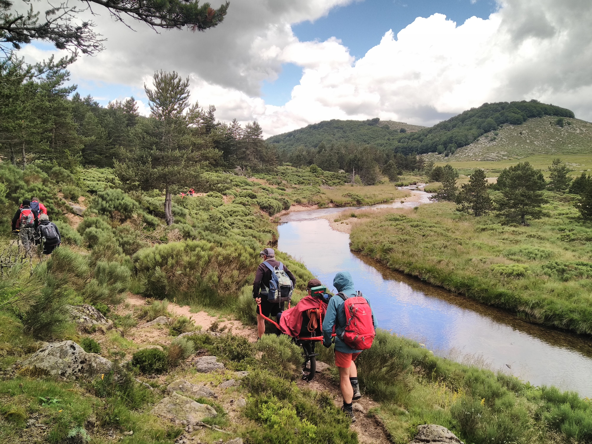

##Webinaire Carte Blanche #33 -

**Mardi 19 janvier 2027 (12h30-13h30)**  

_De la donnée à la carte : informer sur l’accessibilité des espaces naturels_  

par [Marie Lemière] Doctorante en géographie à l'Université Gustave Eiffel/GéoData et cheffe de projet des espaces naturels et des JOP Alpes 2030 
à la Délégation ministérielle à l'accessibilité - Ministère de l'Ecologie

Séjour handi au Mont Lozere (Sources du Tarn-10 © Handi Cap Evasion)

**Résumé** :  En tant que doctorante, j’étudie l’accessibilité des espaces naturels aux personnes en situation de handicap à travers une approche 
géographique fondée sur les données. Mes travaux portent sur l’analyse des informations disponibles, leur qualité et leur structuration, afin de caractériser 
et de cartographier les différentes dimensions de l’accessibilité. L’objectif est de développer des méthodes et des outils géographiques permettant de mieux mesurer, 
représenter et comprendre l’accessibilité des espaces naturels.
  
**Ressources**  
- [Support de la présentation]_à venir_)

- 📺 [Video du webinaire] (_à venir_)

Retour à l'accueil des [Webinaires Cartes Blanches](https://github.com/magisAR9/webinaires)
