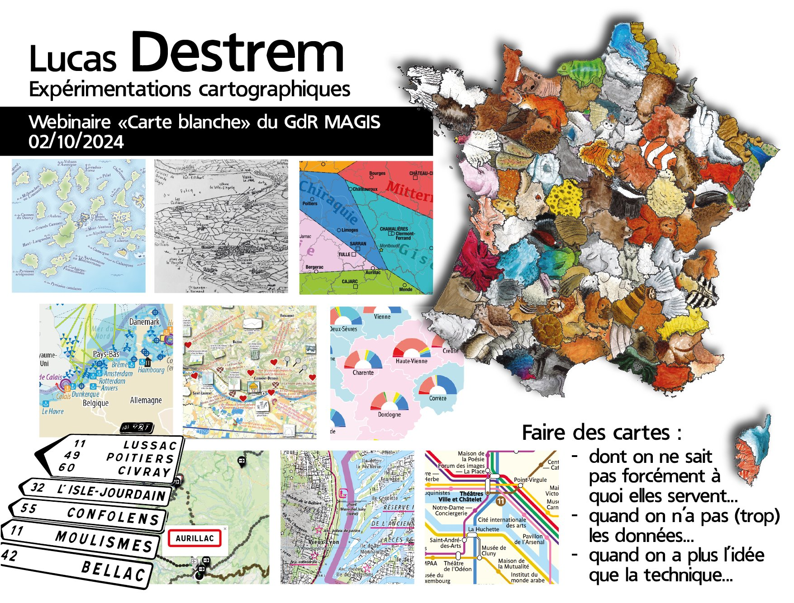

**Webinaire Carte Blanche #18. Mercredi 02 octobre 2024 (12h30-13h30)**  
_Expérimentations cartographiques_  
par [Lucas DESTREM](https://www.lucasdestrem.com/), Géographe et cartographe     

**Résumé** : Passionné par les questions patrimoniales, intéressé par les projets et politiques de développement local et notamment par les thématiques de la culture, de la démocratie, des mobilités et de la communication institutionnelle et territoriale, j'ai créé la micro-entreprise GéoGraphismes, qui me permet d'assurer des missions tout à fait hybrides, au croisement de la cartographie/infographie et de la production de contenus de vulgarisation et médiation. Parallèlement, je mène régulièrement différents projets éditoriaux. 

**Replay**  

- 📺 Video du webinaire: https://sharedocs.huma-num.fr/wl/?id=poLEnaqfDwV3dOMtTerWqZqyu6doUdGi  

Retour à l'accueil des [Webinaires Cartes Blanches](https://github.com/magisAR9/webinaires)
