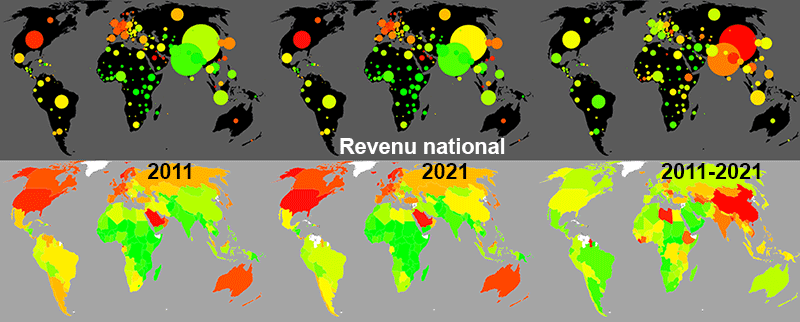

**Webinaire Carte Blanche #7. Jeudi 7 septembre 2023 (12h30-13h30)**
_[www.cartostat.eu](http://www.cartostat.eu/), une application web de cartographie statistique_ par Jean-Philippe GAUTIER 

**Résumé** : Jean-Philippe Gautier présentera une application web de cartographie statistique automatique, dont quelques résultats sont entreposés sur http://www.cartostat.eu/. Les choix graphiques et statistiques que cette automatisation implique seront soumis à la critique, de même que l'on pourra, plus généralement, s'interroger sur le sens, l'utilité et les perspectives d'une industrialisation de la cartographie statistique élémentaire.
La séquence débute avec [une démonstration vidéo de 25 minutes préenregistrée](https://podv2.unistra.fr/media/videos/02d91dc5c809fd175b161f28b3576e8b60a408fde4dd4e58dbe722ffde03252d/52549/720p_video1116348838.mp4)* qui présente l'application.
* solution adoptée pour sécuriser une connexion internet instable.

**Accès au webinaire**  
[Lien](https://bbb.unistra.fr/b/bro-r7m-ugj-wpp)  
- Code d'accès : 002585  

Retour à l'accueil des [Webinaires Cartes Blanches](https://github.com/magisAR9/webinaires)
