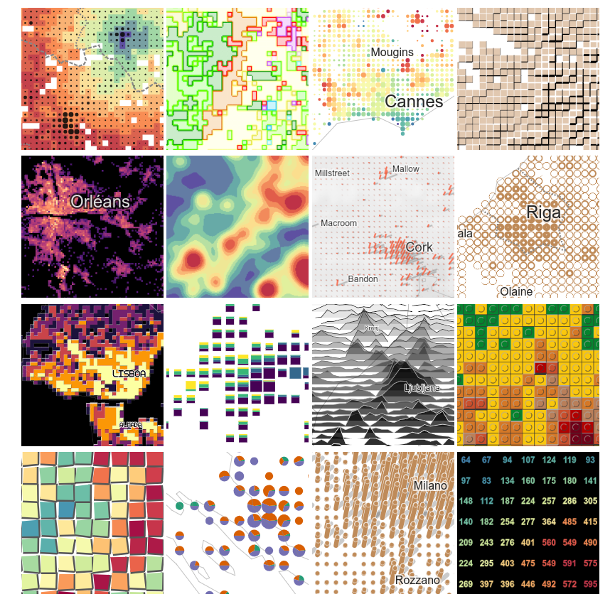

**Webinaire Carte Blanche #8. jeudi 5 Octobre 2023 (12h30-13h30)**  
Gridviz: Une bibliothèque pour la cartographie en ligne de données carroyées  
par [Julien Gaffuri]([https://datagistips.hypotheses.org/author/datagistips](https://jgaffuri.github.io/)), [@julgaf](https://twitter.com/julgaf), [@julgaf@mapstodon.space](https://mapstodon.space/@julgaf) Eurostat   

Gridviz est une  bibliothèque JavaScript qui permet de visualiser des données quadrillées (ou tout ensemble de données tabulaires avec une position x/y) dans le navigateur dans une grande variété styles cartographiques avancés. 
Contrairement aux outils traditionnels de cartographie web à base de données matricielles, Gridviz effectu tout le rendu tout côté client, à la volée.

**Ressources**  

- 📺 [Vidéo du Webinaire](https://sharedocs.huma-num.fr/wl/?id=RNW9k65Ziq5YhjFfriIvYH1kTGXEAwKs)
- [Slides](img/20231005_gridviz_GDRmagis_gaffuri.pdf)
- [https://jgaffuri.github.io/](https://jgaffuri.github.io/)
- [https://eurostat.github.io/gridviz/](https://eurostat.github.io/gridviz/)

</img>

Retour à l'accueil des [Webinaires Cartes Blanches](https://github.com/magisAR9/webinaires)

