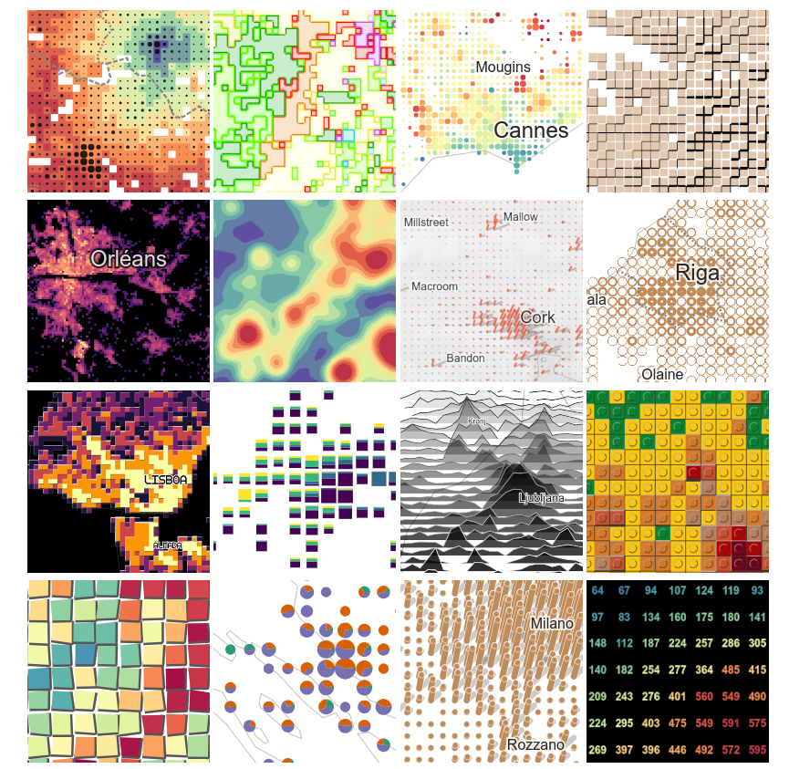

**Webinaire Carte Blanche #8. jeudi 5 Octobre 2023 (12h30-13h30)**  
Gridviz  
par [Julien Gaffuri]([https://datagistips.hypotheses.org/author/datagistips](https://jgaffuri.github.io/)), [@julgaf](https://twitter.com/julgaf), [@julgaf@mapstodon.space](https://mapstodon.space/@julgaf) Eurostats   

Gridviz est une  bibliothèque JavaScript qui permet de visualiser des données quadrillées (ou tout ensemble de données tabulaires avec une position x/y) dans le navigateur dans une grande variété styles cartographiques avancés. 
Contrairement aux outils traditionnels de cartographie web à base de données matricielles, Gridviz effectu tout le rendu tout côté client, à la volée.

**Ressources**  

- [https://jgaffuri.github.io/](https://jgaffuri.github.io/)
- [https://eurostat.github.io/gridviz/](https://jgaffuri.github.io/)

</img>

Retour à l'accueil des [Webinaires Cartes Blanches](https://github.com/magisAR9/webinaires)

