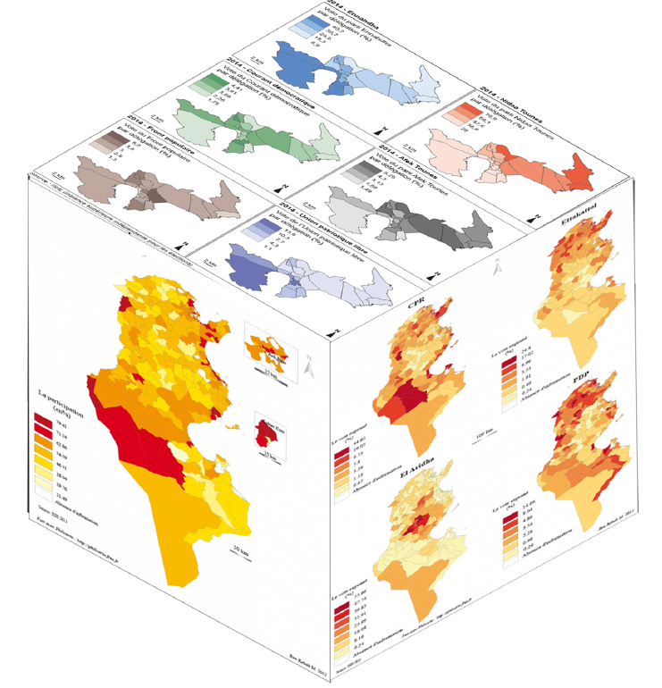

**Webinaire Carte Blanche #9. mardi 7 novembre 2023 (12h30-13h30)**  
_ELYSSA : Cartographier et analyser le vote en Tunisie_  
par [Maher BEN REBAH](https://www.linkedin.com/in/ben-rebah-maher-37831160/?originalSubdomain=fr), Mourad Ben Cheikh, Mohamed Ben Guiza, Alia Gana, 
UMR 7533 LADYSS.

**Résumé** : 
ELYSSA (_ELectoral information and analYSis System for the enhancement of democracy_) est une plateforme qui vise à faciliter l'accès à l'information électorale, en mettant à la disposition de différentes catégories d'utilisateurs (ONG, médias, acteurs politiques, institutions de coopération) des outils d’analyse et de visualisation du vote et du changement politique en Tunisie post-2011 à une échelle très fine (les centres du vote).
Outre l’accès aux données, la plateforme ELYSSA permet une cartographie exploratoire et analytique du vote à travers 3 principaux modules :
La visualisation multiscalaire des résultats électoraux
La visualisation des séries temporelles (évolution du vote)
Le croisement du vote avec les données socio-économiques
S’adressant, essentiellement, à un public non expert, la plateforme propose des supports méthodologiques et des commentaires des cartes réalisées.

**Accès Zoom**  
[Lien](https://univ-eiffel.zoom.us/j/89871486576)  
-ID de réunion : 898 7148 6576 | Code secret : AR9m@gis 

**Ressources**  
📺 [Vidéo](https://sharedocs.huma-num.fr/wl/?id=DCwTF9E7BcrkbNdl5jafA2oRSk7S8xVc)

Retour à l'accueil des [Webinaires Cartes Blanches](https://github.com/magisAR9/webinaires)
